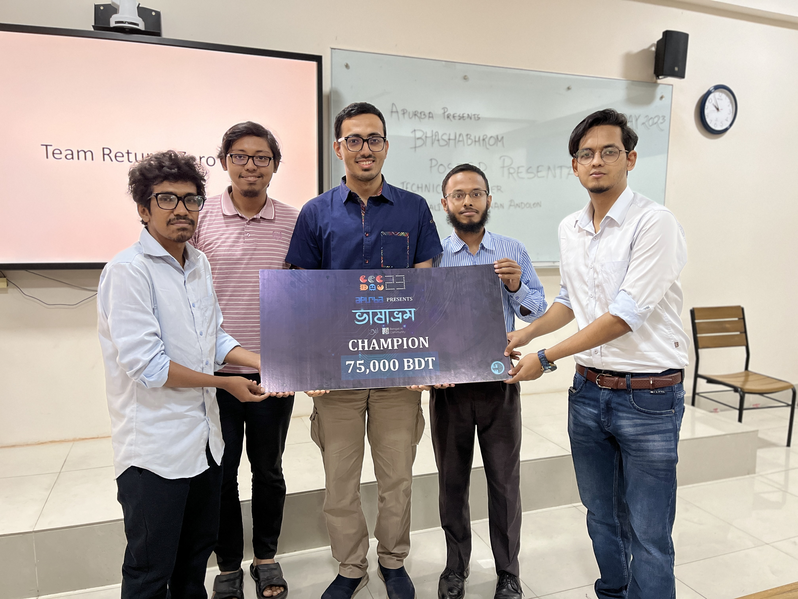

# Bangla_Grammatical_Error_Detection

[Return_Zero_Bangla_GED_IEEE_Conf_Paper.pdf](https://github.com/ridwanultanvir/Bangla_Grammatical_Error_Detection/blob/main/Return_Zero_Bangla_GED_IEEE_Conf_Paper.pdf)

## Project Directory Structure:
### BanglaNLG: BUET CSE NLP Generative model
seq2seq translation 

### data
DataSetFold1_u.csv: gold dataset

pred: preprocessing, postprocessing

### data_old: 
data for old data, do not use or mixup with data

### dcspell data/model
Basically, bangla spell detection+correction dataset

* corpus: 1 million common spell error list (bad words)
* dictionary: BengaliWordList, 310 bangla corpus: merged
* bn_wiki_words: wikipedia title list
* **bad_words_notd_wiki**: words in corpus that are not in dictionary, not in wiki-title-dump
* model: ner, pos

### External_datasets
* sazzed: youtube comments sentiment dataset used for model blind validation

### ninth_place_tsd: code for model
* configs: ymls for training (train, dataset) and validation (eval)
* utils: combine_pred required for ensemble
* train.py: training
* eval.py: for validation and prediction (with_ground or not respectively)
* run.sh: commands
* batch.sh: evaluation in loop

### punctuation-restoration
* run.sh

## Kaggle:

Winners: https://www.kaggle.com/competitions/bengali-ged/discussion/395940

## Literature

[Judge a Sentence by Its Content to Generate Grammatical Errors](https://arxiv.org/pdf/2208.09693.pdf)

[BSpell: A CNN-blended BERT Based Bengali Spell Checker](https://arxiv.org/pdf/2208.09709.pdf)

## Prize: 

